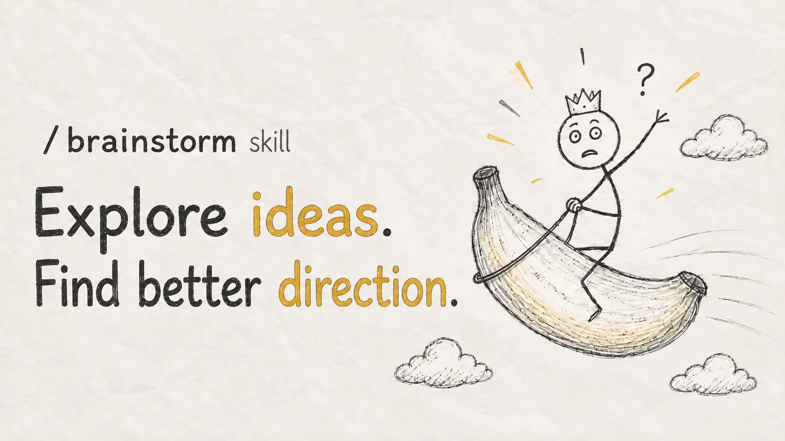

# ✦ /design

[](https://github.com/mizyoel/design)
[](#installation)
[](#)
[](#)
[](LICENSE)

<p align="center">
  
</p>

> **Don't just make it look better. Design how it should work.**

`/design` is a professional UI and UX design skill for coding agents. It turns rough interfaces and product requirements into **clear design directions, thoughtful interactions, implementation-ready decisions, and polished working UI**.

## Installation

```bash
npx skills add mizyoel/design
```

Then bring it a screen, workflow, or feature:

```text
/design redesign the schema field-mapping experience
```

## Why use it?

Coding agents often treat design as decoration:

```text
requirements → components → colors → done
```

`/design` treats it as product engineering:

```text
context → questions → directions → interaction → implementation → review → refine
```

The goal is not a fashionable mockup. The goal is an interface that feels clear, fast, intentional, and ready for real users.

## How it works

1. **Understands the product** — users, workflow, constraints, existing code, and design system.
2. **Asks focused questions** — only when the answer can materially change the experience.
3. **Explores strong directions** — distinct interaction models with honest trade-offs.
4. **Defines the experience** — hierarchy, layout, states, behavior, motion, and responsive rules.
5. **Implements the design** — using the existing stack and reusable components.
6. **Reviews the real result** — checks the rendered interface, finds weak points, and improves them.
7. **Keeps iterating** — the design loop stays open until you decide to stop.

Questions stay short and decision-oriented:

```text
How should users map a large number of source fields?

A. Structured mapping table
B. Guided split-pane workspace
C. Visual node graph
D. Hybrid table with relationship preview
```

## What it can design

- **Application shells** — navigation, workspaces, contextual panels, drawers, and command surfaces.
- **Complex workflows** — import, mapping, review, annotation, editing, configuration, and approvals.
- **Data-heavy interfaces** — tables, filters, search, graphs, timelines, inspectors, and bulk actions.
- **Interaction states** — empty, loading, skeleton, shimmer, progress, success, warning, and recovery.
- **Responsive behavior** — desktop tools, adaptive layouts, rails, panels, and focused mobile flows.
- **Design systems** — tokens, components, spacing, typography, color, motion, and accessibility.
- **Existing UI reviews** — identify clutter, weak hierarchy, friction, inconsistency, and unfinished details.

## Modern patterns, used with purpose

`/design` can work with patterns such as bento grids, command palettes, contextual drawers, split views, adaptive rails, direct manipulation, optimistic interactions, infinite canvases, progressive disclosure, skeletons, and shimmer states.

It recommends a pattern only when it fits the workflow—not because it is fashionable.

## Example directions

For:

```text
/design make schema mapping easier for data engineers
```

The skill might compare:

| Direction | Best for | Trade-off |
| --- | --- | --- |
| Structured mapping table | Fast bulk work and keyboard control | Relationships remain abstract |
| Split-pane mapper | Clear source-to-schema context | Needs careful density management |
| Visual node graph | Understanding complex relationships | Slower for hundreds of fields |

It then recommends the strongest fit and defines the layout, interactions, components, states, and implementation plan.

## The review loop

Implementation is not the finish line. After the UI is built, `/design` reviews the actual result:

- Is the primary action obvious?
- Is the information hierarchy clear?
- Does the workflow remain usable with real data?
- Are loading, error, and empty states complete?
- Does the design work across screen sizes?
- Are spacing, typography, alignment, and motion consistent?

The result is refined until it feels like one product—not a collection of generated components.

## Keep going

Every useful checkpoint keeps the conversation open:

- **Start Implement** — build the selected direction.
- **Review Current UI** — inspect the implemented design and find the next improvements.
- **Enhance This Direction** — push the current concept further.
- **Explore Another Direction** — compare a different interaction model.
- **Create Full Document** — produce a complete UX specification or design plan.
- **Stop Here** — keep the current result as the decision checkpoint.

## Try it

```text
/design redesign this settings page without adding more screens
/design improve the loading and progress experience
/design turn this dense table into a professional workspace
/design review the implemented UI and continue improving it
```

---

<!-- /brainstorm promotional banner: add brainstorm-skill-banner.webp beside this README. -->
<p align="center">
  <a href="https://github.com/mizyoel/brainstorm">
    
  </a>
</p>

<p align="center">
  Still deciding <strong>what</strong> to build? Start with <a href="https://github.com/mizyoel/brainstorm"><code>/brainstorm</code></a>. Then use <code>/design</code> to make it work beautifully.
</p>

---

```bash
npx skills add mizyoel/design
```

**Design the workflow. Build the interface. Review the result. Keep improving.**
